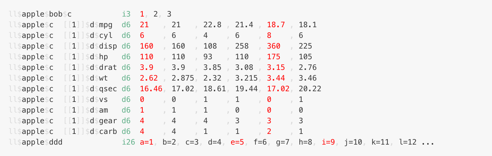

<!-- README.md is generated from README.Rmd. Please edit that file -->

```{r, include = FALSE}
knitr::opts_chunk$set(
  collapse = TRUE,
  comment = "#>",
  fig.path = "man/figures/README-",
  out.width = "100%"
)

library(terse)

generate_html <- interactive()
```

# terse

<!-- badges: start -->

<!-- badges: end -->

`terse` is an alternative to `str()` that aims to be more succinct for simple 
objects.

It was built with (nested) `list` output in mind, but handles `data.frames` and many 
other standard data structures in R.

### Features

* Compact output
* ANSI colour (configurable)
* Alignment of indexes at start of each row, such that names at the same 
  depth are aligned under each other
* Alignment of values within data.frames
* Ability to select+copy+paste the path to a particular element


### Limitations

* Currently supports the standard vector types and lists
* Lists are always recursed in to (there is currently no option to limit the recursion depth)
* Weirder data structures might not work how you want - e.g. list-columns in 
  data.frames, R6 objects etc.
  
If you find a common case that doesn't produce nice output, please file an issue
(or PR!).

## Installation

You can install from [GitHub](https://github.com/coolbutuseless/terse) with:

``` r
# install.packages("devtools")
devtools::install_github("coolbutuseless/terse")
```


```{r echo = FALSE}
#~~~~~~~~~~~~~~~~~~~~~~~~~~~~~~~~~~~~~~~~~~~~~~~~~~~~~~~~~~~~~~~~~~~~~~~~~~~~~
#' Write an object to HTML. Have to run this manually outside of the 'knit'
# process because knitting also uses 'sink()'
#~~~~~~~~~~~~~~~~~~~~~~~~~~~~~~~~~~~~~~~~~~~~~~~~~~~~~~~~~~~~~~~~~~~~~~~~~~~~~
write_html <- function(x, prefix = '', html_file, ...) {
  tmp <- tempfile()
  sink(tmp)
  terse(x, prefix = prefix, width = 95, ...)
  sink()
  zz <- paste0(readLines(tmp), collapse = "<br />")
  ff <- fansi::sgr_to_html(zz)
  writeLines(paste0("<html><pre>", ff, "</pre></html>"), html_file)
}
```


## Terse `data.frame` output

Simple data.frame output

```{r eval=FALSE}
library(terse)
terse(mtcars)
```


```{r eval=generate_html, echo=FALSE}
write_html(mtcars, terse:::ansi('mtcars', 'grey90', use_ansi = TRUE), 'man/figures/mtcars.html')
```

```{r eval=FALSE, echo=FALSE}
htmltools::HTML(readLines("man/figures/mtcars.html"))
```


<details> 
<summary style='color: blue;'> Click here to show/hide - Comparison to str() and glimpse()</summary>
```{r collapse = FALSE, comment = ''}
str(mtcars)
dplyr::glimpse(mtcars)
```

</details>


## Terse `data.frame` output - plain ASCII

Simple data.frame output without ANSI

```{r eval=TRUE, collapse = FALSE, comment = ""}
terse(mtcars, config = list(ansi = FALSE), width = 100)
```


## Terse nested `list` output


```{r eval=TRUE}
ll <- list(
  apple = list(
    bob = list(c = 1:3),
    c = list(
      list(d = head(mtcars))
    ),
    ddd = setNames(1:26, letters)
  )
)
```

```{r eval = FALSE}
terse(ll, config = list(nth = 4, colour_nth = 'red'))
```


```{r eval=generate_html, echo=FALSE}
write_html(ll, terse:::ansi('ll', 'grey90', use_ansi = TRUE), 'man/figures/ll.html', config = list(nth = 4, colour_nth = 'red'))
```

```{r eval=FALSE, echo=FALSE}
htmltools::HTML(readLines("man/figures/ll.html"))
```





<details> 
<summary style='color: blue;'> Click here to show/hide - Comparison to str() </summary>
```{r collapse = FALSE, comment = ''}
str(ll)
```

</details>


## Notes on output

The output consists of 3 sections:

* Names and indices (on the left)
* Compact type + length information
* Vectors of values (on the right)


The green output  consists of a single character for type information, followed
by a length (the number of elements in this vector)

<details open>
<summary> Click to show/hide list of all type information </summary>

* **a** - array
* **m** - matrix
* **l** - logical
* **f** - factor
* **p** - POSIXct
* **P** - POSIXlt
* **D** - Date
* **n** - name
* **i** - integer
* **d** - double
* **r** - raw
* **c** - character
* **C** - complex
* **N** - null
* **K** - call
* **F** - function
* **E** - environment
* **e** - expression
* **L** - list
* **x** - unknown

</details>


## Config

`terse()` takes a `config` argument which must be a named list.  Possible elements 
are:

* `ansi`        - Use ANSI colouring? default: `TRUE`
* `soft`        - non-highlight colour. default: `grey40`
* `gsep`        - separator for vector output. default: `,`
* `colour_nth`  - colour for every nth vector element. default: `blue4`
* `colour_all`  - colour for all other vector elements. default: `grey40`
* `colour_type` - colour for the type/length meta information. default: `seagreen`
* `nth`         - interval for colouring vector elements. default: `0` (off)


## Related Software

* Base R [utils::str()]()
* [dplyr::glimpse()]()

## Acknowledgements

* R Core & CRAN maintainers for giving me a playground
* [Brodie Gaslam](https://twitter.com/BrodieGaslam) for the excellent ANSI tools in [fansi](https://cran.r-project.org/package=fansi)
* [Deemah](https://twitter.com/dmi3k) and 
  [Jonathan Carroll](https://twitter.com/carroll_jono) for helping me find a 
  good name
