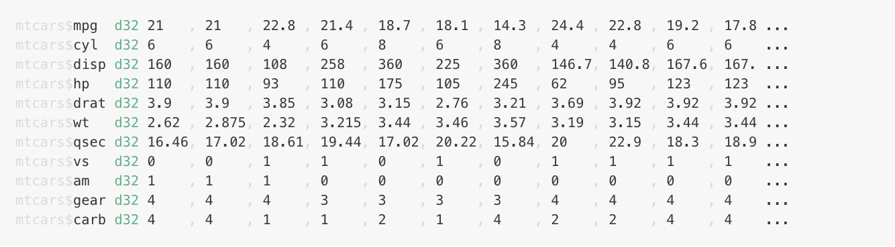

<!-- README.md is generated from README.Rmd. Please edit that file -->

# terse

<!-- badges: start -->


<!-- badges: end -->

`terse` is an alternative to `str()` that aims to be more succinct for
simple objects.

It was built with (nested) `list` output in mind, but handles
`data.frames` and many other standard data structures in R.

### Features

  - Compact output
  - ANSI colour (configurable)
  - Alignment of indexes at start of each row, such that names at the
    same depth are aligned under each other
  - Alignment of values within data.frames

### Limitations

  - Currently supports the standard vector types and lists
  - Lists are always recursed in to (there is currently no option to
    limit the recursion depth)
  - Weirder data structures might not work how you want -
    e.g. list-columns in data.frames, R6 objects etc.

If you find a common case that doesn’t produce nice output, please file
an issue (or PR\!).

## Installation

You can install from [GitHub](https://github.com/coolbutuseless/terse)
with:

``` r
# install.packages("devtools")
devtools::install_github("coolbutuseless/terse")
```

## Terse `data.frame` output

Simple data.frame output

``` r
library(terse)
terse(mtcars)
```

``` r
htmltools::HTML(readLines("man/figures/mtcars.html"))
```



<details>

<summary style='color: blue;'> Click here to show/hide - Comparison to
str() and glimpse()</summary>

``` r
str(mtcars)
```

    'data.frame':   32 obs. of  11 variables:
     $ mpg : num  21 21 22.8 21.4 18.7 18.1 14.3 24.4 22.8 19.2 ...
     $ cyl : num  6 6 4 6 8 6 8 4 4 6 ...
     $ disp: num  160 160 108 258 360 ...
     $ hp  : num  110 110 93 110 175 105 245 62 95 123 ...
     $ drat: num  3.9 3.9 3.85 3.08 3.15 2.76 3.21 3.69 3.92 3.92 ...
     $ wt  : num  2.62 2.88 2.32 3.21 3.44 ...
     $ qsec: num  16.5 17 18.6 19.4 17 ...
     $ vs  : num  0 0 1 1 0 1 0 1 1 1 ...
     $ am  : num  1 1 1 0 0 0 0 0 0 0 ...
     $ gear: num  4 4 4 3 3 3 3 4 4 4 ...
     $ carb: num  4 4 1 1 2 1 4 2 2 4 ...

``` r
dplyr::glimpse(mtcars)
```

    Rows: 32
    Columns: 11
    $ mpg  <dbl> 21.0, 21.0, 22.8, 21.4, 18.7, 18.1, 14.3, 24.4, 22.8, 19.2, 17.8…
    $ cyl  <dbl> 6, 6, 4, 6, 8, 6, 8, 4, 4, 6, 6, 8, 8, 8, 8, 8, 8, 4, 4, 4, 4, 8…
    $ disp <dbl> 160.0, 160.0, 108.0, 258.0, 360.0, 225.0, 360.0, 146.7, 140.8, 1…
    $ hp   <dbl> 110, 110, 93, 110, 175, 105, 245, 62, 95, 123, 123, 180, 180, 18…
    $ drat <dbl> 3.90, 3.90, 3.85, 3.08, 3.15, 2.76, 3.21, 3.69, 3.92, 3.92, 3.92…
    $ wt   <dbl> 2.620, 2.875, 2.320, 3.215, 3.440, 3.460, 3.570, 3.190, 3.150, 3…
    $ qsec <dbl> 16.46, 17.02, 18.61, 19.44, 17.02, 20.22, 15.84, 20.00, 22.90, 1…
    $ vs   <dbl> 0, 0, 1, 1, 0, 1, 0, 1, 1, 1, 1, 0, 0, 0, 0, 0, 0, 1, 1, 1, 1, 0…
    $ am   <dbl> 1, 1, 1, 0, 0, 0, 0, 0, 0, 0, 0, 0, 0, 0, 0, 0, 0, 1, 1, 1, 0, 0…
    $ gear <dbl> 4, 4, 4, 3, 3, 3, 3, 4, 4, 4, 4, 3, 3, 3, 3, 3, 3, 4, 4, 4, 3, 3…
    $ carb <dbl> 4, 4, 1, 1, 2, 1, 4, 2, 2, 4, 4, 3, 3, 3, 4, 4, 4, 1, 2, 1, 1, 2…

</details>

## Terse `data.frame` output - plain ASCII

Simple data.frame output without ANSI

``` r
terse(mtcars, config = list(ansi = FALSE), width = 100)
```

    mtcars$mpg  d32 21   , 21   , 22.8 , 21.4 , 18.7 , 18.1 , 14.3 , 24.4 , 22.8 , 19.2 , 17.8 , 16 ...
    mtcars$cyl  d32 6    , 6    , 4    , 6    , 8    , 6    , 8    , 4    , 4    , 6    , 6    , 8  ...
    mtcars$disp d32 160  , 160  , 108  , 258  , 360  , 225  , 360  , 146.7, 140.8, 167.6, 167.6, 27 ...
    mtcars$hp   d32 110  , 110  , 93   , 110  , 175  , 105  , 245  , 62   , 95   , 123  , 123  , 18 ...
    mtcars$drat d32 3.9  , 3.9  , 3.85 , 3.08 , 3.15 , 2.76 , 3.21 , 3.69 , 3.92 , 3.92 , 3.92 , 3. ...
    mtcars$wt   d32 2.62 , 2.875, 2.32 , 3.215, 3.44 , 3.46 , 3.57 , 3.19 , 3.15 , 3.44 , 3.44 , 4. ...
    mtcars$qsec d32 16.46, 17.02, 18.61, 19.44, 17.02, 20.22, 15.84, 20   , 22.9 , 18.3 , 18.9 , 17 ...
    mtcars$vs   d32 0    , 0    , 1    , 1    , 0    , 1    , 0    , 1    , 1    , 1    , 1    , 0  ...
    mtcars$am   d32 1    , 1    , 1    , 0    , 0    , 0    , 0    , 0    , 0    , 0    , 0    , 0  ...
    mtcars$gear d32 4    , 4    , 4    , 3    , 3    , 3    , 3    , 4    , 4    , 4    , 4    , 3  ...
    mtcars$carb d32 4    , 4    , 1    , 1    , 2    , 1    , 4    , 2    , 2    , 4    , 4    , 3  ...

## Terse nested `list` output

``` r
ll <- list(
  apple = list(
    bob = list(c = 1:3),
    c = list(
      list(d = head(mtcars))
    ),
    ddd = setNames(1:26, letters)
  )
)
```

``` r
terse(ll, config = list(nth = 4, colour_nth = 'red'))
```

``` r
htmltools::HTML(readLines("man/figures/ll.html"))
```


<details>

<summary style='color: blue;'> Click here to show/hide - Comparison to
str() </summary>

``` r
str(ll)
```

    List of 1
     $ apple:List of 3
      ..$ bob:List of 1
      .. ..$ c: int [1:3] 1 2 3
      ..$ c  :List of 1
      .. ..$ :List of 1
      .. .. ..$ d:'data.frame': 6 obs. of  11 variables:
      .. .. .. ..$ mpg : num [1:6] 21 21 22.8 21.4 18.7 18.1
      .. .. .. ..$ cyl : num [1:6] 6 6 4 6 8 6
      .. .. .. ..$ disp: num [1:6] 160 160 108 258 360 225
      .. .. .. ..$ hp  : num [1:6] 110 110 93 110 175 105
      .. .. .. ..$ drat: num [1:6] 3.9 3.9 3.85 3.08 3.15 2.76
      .. .. .. ..$ wt  : num [1:6] 2.62 2.88 2.32 3.21 3.44 ...
      .. .. .. ..$ qsec: num [1:6] 16.5 17 18.6 19.4 17 ...
      .. .. .. ..$ vs  : num [1:6] 0 0 1 1 0 1
      .. .. .. ..$ am  : num [1:6] 1 1 1 0 0 0
      .. .. .. ..$ gear: num [1:6] 4 4 4 3 3 3
      .. .. .. ..$ carb: num [1:6] 4 4 1 1 2 1
      ..$ ddd: Named int [1:26] 1 2 3 4 5 6 7 8 9 10 ...
      .. ..- attr(*, "names")= chr [1:26] "a" "b" "c" "d" ...

</details>

## Notes on output

The output consists of 3 sections:

  - Names and indices (on the left)
  - Compact type + length information
  - Vectors of values (on the right)

The green output consists of a single character for type information,
followed by a length (the number of elements in this vector)

<details open>

<summary> Click to show/hide list of all type information </summary>

  - **a** - array
  - **m** - matrix
  - **l** - logical
  - **f** - factor
  - **p** - POSIXct
  - **P** - POSIXlt
  - **D** - Date
  - **n** - name
  - **i** - integer
  - **d** - double
  - **r** - raw
  - **c** - character
  - **C** - complex
  - **N** - null
  - **K** - call
  - **F** - function
  - **E** - environment
  - **e** - expression
  - **L** - list
  - **x** - unknown

</details>

## Config

`terse()` takes a `config` argument which must be a named list. Possible
elements are:

  - `ansi` - Use ANSI colouring? default: `TRUE`
  - `soft` - non-highlight colour. default: `grey40`
  - `gsep` - separator for vector output. default: `,`
  - `colour_nth` - colour for every nth vector element. default: `blue4`
  - `colour_all` - colour for all other vector elements. default:
    `grey40`
  - `colour_type` - colour for the type/length meta information.
    default: `seagreen`
  - `nth` - interval for colouring vector elements. default: `0` (off)

## Related Software

  - Base R [utils::str()]()
  - [dplyr::glimpse()]()

## Acknowledgements

  - R Core & CRAN maintainers for giving me a playground
  - [Brodie Gaslam](https://twitter.com/BrodieGaslam) for the excellent
    ANSI tools in [fansi](https://cran.r-project.org/package=fansi)
  - [Deemah](https://twitter.com/dmi3k) and [Jonathan
    Carroll](https://twitter.com/carroll_jono) for helping me find a
    good name
